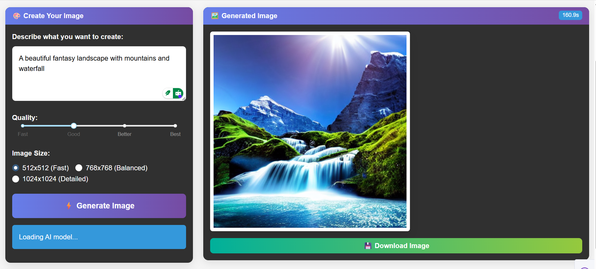

# 🖼️ AI Text-to-Image Generator
This project is an AI Text-to-Image Generator built using Stable Diffusion and PyTorch.
It converts natural language prompts into high-quality images through a diffusion-based deep learning pipeline, wrapped inside a clean and professional web interface.
The project focuses on learning deep learning by building, while also producing a deployable, real-world AI application.

---

## ✨ Features

🧠 Text-to-Image generation using Stable Diffusion

✍️ Simple input: user provides only a text prompt

🖼️ High-quality image generation (default 512×512)

💾 Automatically saves generated images

⬇️ Download button for generated images

🌐 Interactive web UI built with Dash

🔐 Secure environment variable handling (no secrets committed)

---

## 🖥️ Application UI Preview


---

## 🧠 Tech Stack
### AI / Backend
- Python
- PyTorch
- Hugging Face Diffusers
- Stable Diffusion v1.5

### Frontend
- Dash (Plotly)

### Utilities
- Hugging Face Hub
- Base64 encoding for image rendering
- Local file storage

---

## 🏗️ Project Structure
```text
├── assets/
│   └── AITextToImageGenerator.png    # Project Output / UI preview
│
├── generated_images/                 # Auto-saved generated images
│
├── .env.example                      # Your Huggingface token saved here
├── AI_Text_to_Image_Generator.ipynb  # Notebook version (experimentation)
├── app.py                            # Main Dash application
└── README.md
```

---

## ⚙️ Setup Instructions
### 1️⃣ Clone the Repository
```bash
git clone https://github.com/your-username/ai-text-to-image-generator-clean.git
cd ai-text-to-image-generator-clean
```

### 2️⃣ Configure Environment Variables
Create a .env file (do NOT commit it):
```bash
HF_TOKEN=your_huggingface_access_token
```
Use .env.example as reference.

### 3️⃣ Run the Application
```bash
python app.py
```

Open browser at:
http://127.0.0.1:8050

---

## 🧪 Example Prompt
A futuristic astronaut riding a horse on Mars, cinematic lighting, ultra realistic

---

## 🧩 How It Works
1. User enters a text prompt
2. Prompt is encoded using a Transformer-based text encoder
3. Diffusion UNet gradually denoises random noise into an image
4. VAE decodes the final latent representation
5. Image is displayed, saved locally, and available for download

---

## 📚 Learning Outcomes
This project demonstrates understanding of:
- Diffusion models and image generation
- Transformer-based text encoders
- Model inference pipelines
- Secure environment configuration
- Dash callbacks and UI state handling
- Real-world AI project structure

---

## 🔮 Future Improvements
- Negative prompt input
- Adjustable inference steps & guidance scale
- Batch image generation
- Image-to-image generation
- LoRA / ControlNet support
- Cloud deployment (Hugging Face Spaces / AWS)

---

## 👤 Author
### Abhinav Verma<br>
### Vadde Kishore<br>
<br>
Focused on building production-ready AI systems and mastering Deep Learning through projects.

---

## 📜 License
This project is for educational and research purposes.
Please comply with the licenses of Stable Diffusion and Hugging Face models.
